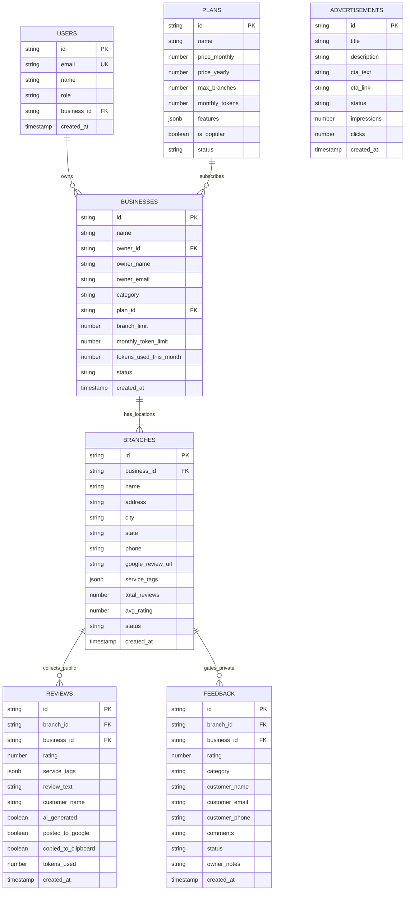

# Tap Review AI - Production NestJS + React AI Google Review SaaS Platform

Tap Review AI is an enterprise-grade multi-tenant SaaS platform allowing businesses to turn customer visits into verified 5-star Google Reviews via QR Code scanning and Gemini AI review generation. It includes an intelligent negative feedback gatekeeper (< 4 stars redirected to internal private management feedback).

The backend is built with **NestJS Framework**, organized cleanly into feature modules with NestJS Controllers, Services, Interceptors, Filters, and Dependency Injection.

---

## 📐 Database ER Diagram (Mermaid)



---

## 📂 Project Directory Structure

```
├── .env.example                       # Environment Variable Declarations
├── migrations/                        # SQL Migration & Seed Scripts
│   ├── 001_initial_schema.sql         # DDL: Tables, Constraints, Indexes
│   └── 002_seed_data.sql              # DML: Seed Data for Businesses, Branches, Plans, Ads
├── server.ts                          # Express + NestJS Application Bootstrapper
├── src/
│   ├── backend/
│   │   ├── nestjs/                     # ⚡ NESTJS BACKEND CORE
│   │   │   ├── app.module.ts           # Root NestJS Module
│   │   │   ├── common/
│   │   │   │   ├── filters/            # Global Exception Filter
│   │   │   │   └── interceptors/      # Response Envelope Interceptor
│   │   │   └── modules/                # Feature Modules
│   │   │       ├── ads/                # AdsController, AdsService, AdsModule
│   │   │       ├── analytics/          # AnalyticsController, AnalyticsService, AnalyticsModule
│   │   │       ├── auth/               # AuthController, AuthService, AuthModule
│   │   │       ├── branches/           # BranchesController, BranchesService, BranchesModule
│   │   │       ├── businesses/         # BusinessesController, BusinessesService, BusinessesModule
│   │   │       ├── feedback/           # FeedbackController, FeedbackService, FeedbackModule
│   │   │       ├── health/             # HealthController, HealthModule
│   │   │       ├── plans/              # PlansController, PlansService, PlansModule
│   │   │       ├── reviews/            # ReviewsController, ReviewsService, ReviewsModule
│   │   │       └── settings/           # SettingsController, SettingsService, SettingsModule
│   │   ├── database/
│   │   │   ├── runMigrations.ts       # Migration Engine Runner (PostgreSQL + In-Memory)
│   │   │   └── store.ts               # In-Memory State & DB Proxy Engine
│   │   └── services/
│   │       └── aiService.ts           # Gemini 3.6 Flash Server-Side AI Client
│   ├── frontend/
│   │   ├── components/
│   │   │   ├── DevPortalSwitcher.tsx  # Developer Mode Portal Quick Switcher
│   │   │   ├── Navbar.tsx             # Shared Navigation Bar
│   │   │   ├── QRCodeStudio.tsx       # Printable QR Code & Table Tent Poster Studio
│   │   │   └── StatCard.tsx           # Dashboard Metric Card Component
│   │   └── portals/
│   │       ├── AgencyPortal.tsx       # 3. Agency Admin Portal
│   │       ├── BusinessPortal.tsx     # 2. Business Owner Portal
│   │       └── CustomerPortal.tsx     # 1. Customer Review Flow (Public QR)
│   ├── App.tsx                        # Main Router Component
│   ├── main.tsx                       # React Entry Point
│   └── types.ts                       # Shared TypeScript Interfaces & Data Models
├── metadata.json                      # Applet Manifest Metadata
└── package.json                       # Scripts and Dependencies
```

---

## 🛠️ Installation & Local Setup

### Prerequisites
- Node.js >= 18.0.0
- npm >= 9.0.0
- PostgreSQL (Optional; built-in state engine activates seamlessly if PostgreSQL is not provided)

### Step 1: Clone & Install Dependencies
```bash
git clone https://github.com/agency/tap-review-ai.git
cd tap-review-ai
npm install
```

### Step 2: Configure Environment Variables
Copy `.env.example` to `.env`:
```bash
cp .env.example .env
```
Ensure your `GEMINI_API_KEY` and optional `DATABASE_URL` (PostgreSQL) are set in `.env`.

### Step 3: Run Database Migrations & Seeds
```bash
npm run migration:run
# or
npm run seed
```

### Step 4: Start Development Server
```bash
npm run dev
```
Open `http://localhost:3000` in your browser.

---

## 📡 NestJS REST API Reference & Endpoints

All REST APIs strictly return the standard JSON envelope formatted by the NestJS `ResponseInterceptor`:
```json
{
  "success": true,
  "message": "Operation successful",
  "data": {},
  "errors": null
}
```

| Method | Route | Description | NestJS Module |
| :--- | :--- | :--- | :--- |
| `GET` | `/api/health` | Service health status & system metrics | `HealthModule` |
| `POST` | `/api/auth/login` | Authenticate user (Agency Admin or Business Owner) | `AuthModule` |
| `GET` | `/api/auth/me` | Fetch active user profile | `AuthModule` |
| `GET` | `/api/businesses` | List client businesses (Filterable by `ownerId`) | `BusinessesModule` |
| `POST` | `/api/businesses` | Onboard new client business | `BusinessesModule` |
| `PUT` | `/api/businesses/:id` | Update business branch limits or token quotas | `BusinessesModule` |
| `DELETE` | `/api/businesses/:id` | Soft delete client business | `BusinessesModule` |
| `GET` | `/api/branches` | List location branches (Filterable by `businessId`) | `BranchesModule` |
| `POST` | `/api/branches` | Add location branch with Google Review link | `BranchesModule` |
| `PUT` | `/api/branches/:id` | Update branch address, phone, or service tags | `BranchesModule` |
| `POST` | `/api/reviews/generate` | Generate AI review draft using Gemini 3.6 Flash | `ReviewsModule` |
| `POST` | `/api/reviews` | Log completed public 5-star Google review | `ReviewsModule` |
| `GET` | `/api/reviews` | Retrieve review logs & analytics | `ReviewsModule` |
| `POST` | `/api/feedback` | Submit private customer feedback (< 4 stars) | `FeedbackModule` |
| `GET` | `/api/feedback` | Retrieve private feedback inbox for business owners | `FeedbackModule` |
| `PUT` | `/api/feedback/:id` | Update feedback status (`NEW`, `IN_PROGRESS`, `RESOLVED`) | `FeedbackModule` |
| `GET` | `/api/plans` | Fetch SaaS subscription plans | `PlansModule` |
| `POST` | `/api/plans` | Create SaaS subscription plan | `PlansModule` |
| `GET` | `/api/ads` | Fetch promotional dashboard banners | `AdsModule` |
| `POST` | `/api/ads` | Create promotional banner ad | `AdsModule` |
| `GET` | `/api/settings/config` | Retrieve agency AI key config & platform settings | `SettingsModule` |
| `POST` | `/api/settings/config` | Update Gemini API keys and default prompt templates | `SettingsModule` |
| `GET` | `/api/analytics/agency` | Agency platform-wide revenue & token analytics | `AnalyticsModule` |
| `GET` | `/api/analytics/business/:id`| Business owner review stats & token usage meter | `AnalyticsModule` |

---

## 🚀 Production Deployment Guide

### Option 1: Cloud Run / Containerized Docker
```dockerfile
# Build image
docker build -t tap-review-ai .

# Run container
docker run -p 3000:3000 -e GEMINI_API_KEY="your_api_key" tap-review-ai
```

### Option 2: Standalone Node.js Build
```bash
npm run build
npm run start
```
The application will bundle the NestJS backend with `esbuild` into `dist/server.cjs` and serve static Vite assets on port `3000`.
